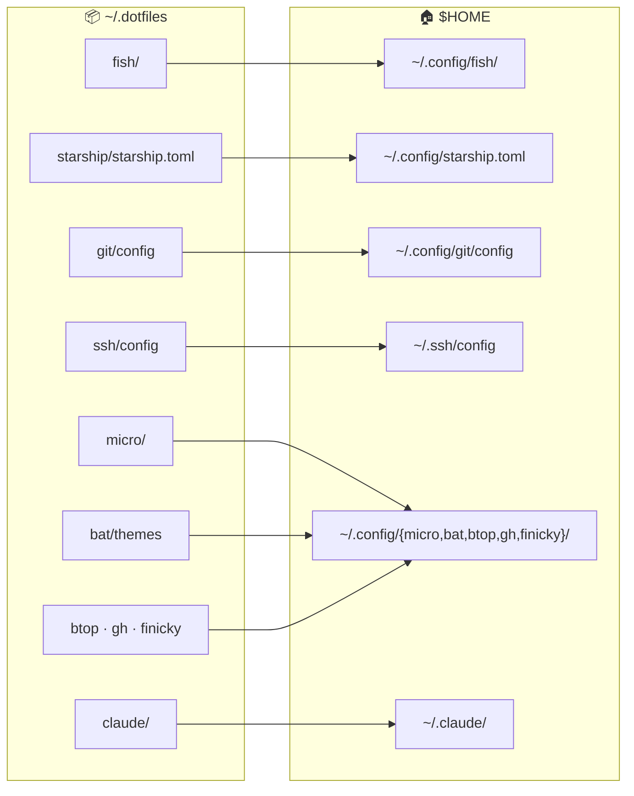
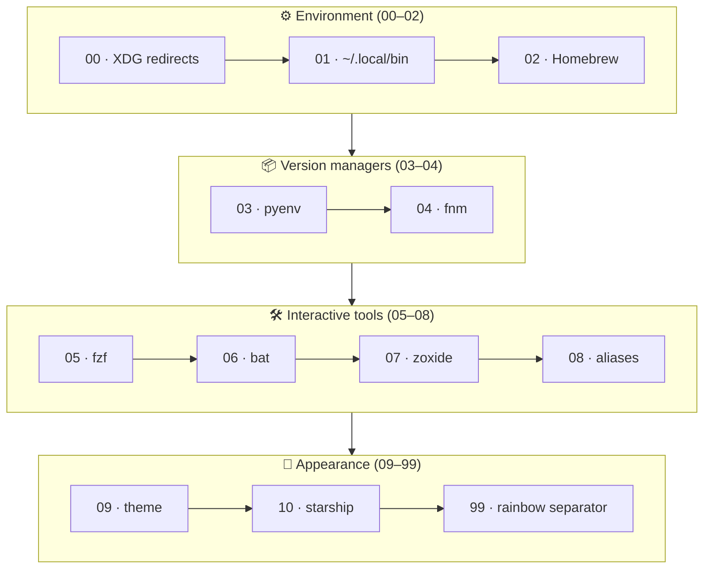
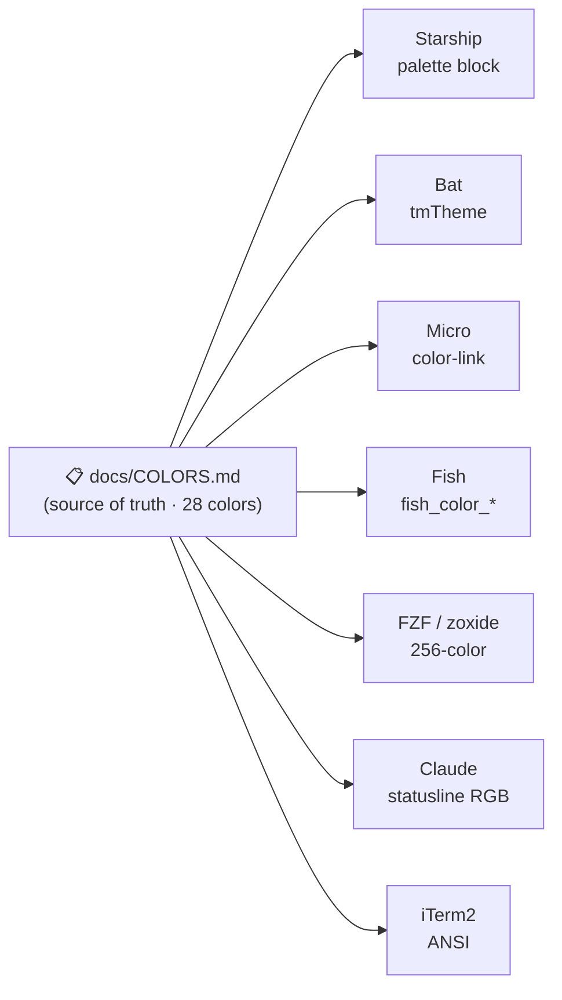
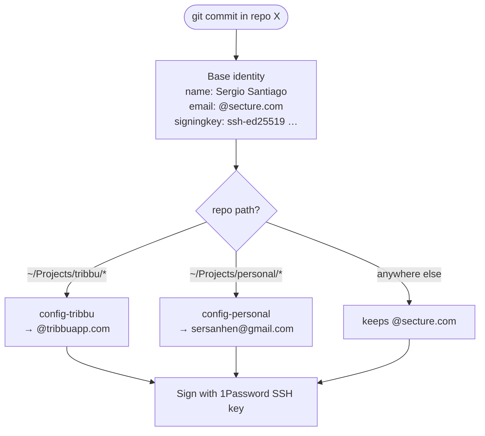

# 🛠️ Sergio’s .dotfiles — macOS Fish Shell Environment

This repository contains my personal macOS development environment configuration, with a focus on:

- 🐟 **Fish shell**
    - Clean setup with modular functions, aliases, color configuration, and a Starship prompt theme aligned to the
      terminal palette.
    - Modular configuration with 12 numbered conf.d files (00-99) for controlled load order.
    - Custom functions: `fish_greeting`, `fish_user_key_bindings`.
    - Compact welcome banner with rainbow effect (`lolcat`) and fixed seed for consistent colors.
- 🧾 **Aliases**
    - Well-structured and documented with practical usage examples, autoloaded from `conf.d/08-aliases.fish`.
    - Includes smart aliases for modern tools: `l`/`ll` (eza), `v` (bat), `z` (zoxide), `tree` (eza --tree), `c`/`c-yolo` (claude)...
- 🎯 **FZF (Fuzzy Finder)**
    - Comprehensive configuration with `fd` integration for fast file/directory search.
    - Responsive preview windows with `bat` (files) and `eza` (directories).
    - Colors synchronized with the `linked_data_dark_rainbow` palette.
    - Custom keybindings and 80% height layout with rounded borders.
- 🔐 **SSH**
    - Public/private split config, managed from `.dotfiles/ssh` and using 1Password SSH agent for secure key management.
- 🧠 **Git**
    - SSH-based commit signing (1Password agent) with `micro` as commit editor.
    - **Directory-based identities** via `includeIf`: a base identity (`@secture.com`) with automatic
      email overrides for Tribbu (`~/Projects/tribbu/`) and personal (`~/Projects/personal/`) repos,
      all sharing a single signing key. See [Git identities](#-git-identities-multi-account).
- ✏️ **Micro editor**
    - Lightweight terminal-based editor with custom settings and a matching `linked-data-dark-rainbow` color scheme for
      a consistent look with Fish and Starship.
    - Custom theme with true color, icon-based statusline, consistent syntax highlighting, 4-space indentation... and
      more.
- 🌈 **Color theme**
    - Custom `linked_data_dark_rainbow` theme for consistent syntax highlighting, pager, and selection colors.
      Implemented across:
        - Starship (`palettes.linked_data_dark_rainbow` palette, three-line prompt with powerline segments)
        - Fish (`09-theme.fish`)
        - Bat (`linked-data-dark-rainbow.tmTheme`)
        - Micro editor (`linked-data-dark-rainbow.micro`)
        - FZF (`05-fzf.fish` with synchronized color palette)
        - iTerm2 (ANSI colors + UI elements)
    - Includes a custom rainbow separator (`99-rainbow_separator.fish`) to visually divide command output from the next
      prompt.
    - All colors are optimized for pure black backgrounds as well as setups with subtle transparency and blurred effects, ensuring high contrast.
    - **📋 Full color palette documentation:** See [COLORS.md](docs/COLORS.md) for the complete 28-color palette with hex/RGB values and semantic usage across all tools.
- 🔗 **Finicky**
    - Smart browser routing (config in TypeScript). Sets Chrome as the default browser, opens Google Meet
      links automatically in the **Tribbu** Chrome profile, and sends Zoom links straight to the native Zoom app.
- 💾 **iTerm2 backup**
    - Full export of preferences (profiles, colors, fonts), easily restorable.
- 🤖 **Claude Code**
    - Custom statusline configuration with comprehensive git, system, and environment info.
    - Usage quota bar with 5-hour utilization percentage, gradient bar, and reset countdown.
    - Granular permission rules: read-only git/gh commands auto-allowed, mutations require confirmation.
    - Tuned for Opus 4.8: auto mode, `high` effort, Spanish responses, voice dictation, fullscreen TUI, and no AI attribution in commits/PRs.
    - Global instructions (`CLAUDE.md`) and settings tracked in `.dotfiles/claude/` with custom `statusline.sh` script.
- 📊 **btop**
    - Modern system resource monitor with custom configuration.
    - Truecolor support, braille graphs, rounded corners, and transparent background.
    - Fast 100ms refresh rate for real-time monitoring.
- 🐙 **GitHub CLI (gh)**
    - GitHub command-line tool configured with SSH protocol.

> These files are meant for personal use and backup. Feel free to explore or adapt.

---

## 🗺️ Architecture

### Repository layout & symlink map

Configs live in this repo and are symlinked into their expected locations (`make link`).
`git/config-personal` and `git/config-tribbu` are **not** symlinked — they are pulled in by
`git/config` via absolute `includeIf` paths.



### Fish load order (`conf.d/`)

Fragments are sourced in lexical order. Environment first, then version managers and tools,
then appearance, and finally a cosmetic separator hook.



### Color theme propagation

`docs/COLORS.md` is the single source of truth for the `linked_data_dark_rainbow` palette,
replicated by hand into each tool's native format. `make colors-check` lints for drift.



### Git identity resolution

A commit's author email is chosen by where the repository lives; the name and signing key
are always inherited from the base identity.



---

## 🔧 Setup & Usage Guide (Restore on a new machine)

### ⚡ Quick start

```bash
git clone git@github.com:sergio-santiago/.dotfiles.git ~/.dotfiles
cd ~/.dotfiles
make install          # installs Brewfile packages + symlinks every config
make default-shell    # set fish as the default login shell
make doctor           # verify tools, symlinks and environment
```

Then finish the [manual steps](#-manual-steps-not-automatable) (1Password SSH agent, iTerm2 prefs).
The sections below explain each piece in detail.

#### Make targets

| Target | What it does |
|--------|--------------|
| `make install` | `brew` + `link` — full setup on a new machine |
| `make brew` | Install all packages/apps from the `Brewfile` |
| `make link` | Symlink configs into `~/.config`, `~/.claude`, `~/.ssh` (idempotent, backs up existing files) |
| `make default-shell` | Add Homebrew fish to `/etc/shells` and `chsh` to it |
| `make doctor` | Verify required tools, symlinks and environment are healthy |
| `make colors-check` | Lint the `linked_data_dark_rainbow` palette for drift |

> The installer is **idempotent** and **non-destructive**: re-running it is safe, and any existing
> file it would overwrite is first moved to `~/.dotfiles-backup/<timestamp>/`.

---

### 🧬 Clone repository

```bash
git clone git@github.com:sergio-santiago/.dotfiles.git ~/.dotfiles
```

---

### 📦 Install dependencies with Brewfile

Development environment is reproducible with [Homebrew](https://brew.sh) and a `Brewfile`.  
Run the following command to install CLI tools and apps:

```bash
brew bundle --file ~/.dotfiles/Brewfile
```

This will install:

#### 🔖 Taps
- **domt4/autoupdate** — keep Homebrew itself and formulae up to date
- **hamed-elfayome/claude-usage** — Claude API usage tracking
- **hashicorp/tap** — HashiCorp tools (provides `terraform`)
- **sst/tap** — custom tap (provides `opencode` CLI)

#### 🛠️ CLI tools
- **awscli** — AWS command-line interface
- **bat** — `cat` clone with syntax highlighting
- **btop** — modern system resource monitor
- **eza** — improved `ls` with colors and icons
- **fd** — fast and user-friendly alternative to `find`
- **ffmpeg** — audio/video codec converter and streamer
- **fish** — friendly interactive shell
- **fnm** — fast Node.js version manager
- **fzf** — fuzzy finder for the terminal
- **gh** — GitHub CLI tool
- **jq** — JSON processor for command line
- **lolcat** — rainbow coloring for terminal output
- **micro** — lightweight terminal text editor
- **mole** — deep clean and optimize macOS
- **node** — JavaScript runtime
- **opencode** — lightweight open-source Claude-compatible CLI
- **poppler** — PDF rendering library
- **pyenv** — manage multiple Python versions
- **starship** — fast and customizable prompt
- **terraform** — infrastructure as code tool
- **zoxide** — smarter `cd` command with jump history

#### 💻 Apps (casks)
- **Claude Usage Tracker** — Claude API usage dashboard
- **Codex** — agentic coding CLI
- **Finicky** — control which browser/profile opens links
- **Fira Code Nerd Font** — a developer-friendly font with ligatures and Nerd Font icons
- **IINA** — modern video player for macOS
- **iTerm2** — terminal emulator for macOS
- **Thaw** — menu bar manager for macOS

> 🔄️ You can enable automatic updates for Homebrew itself, formulas, and casks with:  
> `brew autoupdate start 86400 --upgrade --cleanup --immediate --ac-only`  
> (runs daily, cleans old versions, starts at every system login, only on AC power)

---

### 🔗 Symlink configs

The recommended way is the installer, which creates every symlink, backs up anything it would
overwrite, creates `~/.ssh/config.private`, and rebuilds the bat cache:

```bash
make link
```

It wires the repo into `$HOME` like this:

| Source (`~/.dotfiles/…`) | Destination |
|--------------------------|-------------|
| `ssh/config` | `~/.ssh/config` |
| `fish/{conf.d,functions,config.fish}` | `~/.config/fish/…` |
| `starship/starship.toml` | `~/.config/starship.toml` |
| `git/config` | `~/.config/git/config` |
| `micro/{settings.json,colorschemes/…}` | `~/.config/micro/…` |
| `bat/themes` | `~/.config/bat/themes` |
| `finicky/finicky.ts` | `~/.config/finicky/finicky.ts` |
| `btop/btop.conf` | `~/.config/btop/btop.conf` |
| `gh/config.yml` | `~/.config/gh/config.yml` |
| `claude/{CLAUDE.md,settings.json,statusline.sh}` | `~/.claude/…` |

<details>
<summary>Prefer to link manually? (click to expand)</summary>

```bash
# SSH
mkdir -p ~/.ssh
ln -sfh ~/.dotfiles/ssh/config ~/.ssh/config

# Fish
mkdir -p ~/.config/fish
ln -sfh ~/.dotfiles/fish/conf.d ~/.config/fish/conf.d
ln -sfh ~/.dotfiles/fish/functions ~/.config/fish/functions
ln -sfh ~/.dotfiles/fish/config.fish ~/.config/fish/config.fish

# Starship
ln -sfh ~/.dotfiles/starship/starship.toml ~/.config/starship.toml

# Git
mkdir -p ~/.config/git
ln -sfh ~/.dotfiles/git/config ~/.config/git/config

# Micro
mkdir -p ~/.config/micro/colorschemes
ln -sfh ~/.dotfiles/micro/settings.json ~/.config/micro/settings.json
ln -sfh ~/.dotfiles/micro/colorschemes/linked-data-dark-rainbow.micro ~/.config/micro/colorschemes/linked-data-dark-rainbow.micro

# Bat
mkdir -p ~/.config/bat
ln -sfh ~/.dotfiles/bat/themes ~/.config/bat/themes
bat cache --build

# Finicky
mkdir -p ~/.config/finicky
ln -sfh ~/.dotfiles/finicky/finicky.ts ~/.config/finicky/finicky.ts

# Claude Code
mkdir -p ~/.claude
ln -sfh ~/.dotfiles/claude/CLAUDE.md ~/.claude/CLAUDE.md
ln -sfh ~/.dotfiles/claude/settings.json ~/.claude/settings.json
ln -sfh ~/.dotfiles/claude/statusline.sh ~/.claude/statusline.sh

# btop
mkdir -p ~/.config/btop
ln -sfh ~/.dotfiles/btop/btop.conf ~/.config/btop/btop.conf

# GitHub CLI (gh)
mkdir -p ~/.config/gh
ln -sfh ~/.dotfiles/gh/config.yml ~/.config/gh/config.yml
```

> ⚠️ **Note:** Manual symlinks overwrite existing files with no backup — `make link` is safer.

</details>

---

### 🐟 Set fish as the default shell

```bash
make default-shell        # adds fish to /etc/shells and runs chsh
```

Or manually:

```bash
echo /opt/homebrew/bin/fish | sudo tee -a /etc/shells
chsh -s /opt/homebrew/bin/fish
```

---

### 🧠 Git identities (multi-account)

`git/config` defines a base identity and overrides only the **email** per directory, while
`user.name` and the SSH `signingkey` are inherited everywhere (one verified key for all accounts):

| Repo location | Identity file | Email |
|---------------|---------------|-------|
| anywhere (default) | `git/config` | `sergio@secture.com` |
| `~/Projects/tribbu/…` | `git/config-tribbu` | `sergiosantiago@tribbuapp.com` |
| `~/Projects/personal/…` | `git/config-personal` | `sersanhen@gmail.com` |

The overrides are pulled in via `includeIf "gitdir:…"` using absolute paths, so they work without
being symlinked. To use them, just clone repos under the matching directory:

```bash
git -C ~/Projects/tribbu/some-repo config user.email   # → sergiosantiago@tribbuapp.com
```

GitHub HTTPS credentials are delegated to `gh auth git-credential`, so run `gh auth login` once.

---

### 🪄 Manual steps (not automatable)

A few things can't be symlinked and must be done by hand on a new machine:

1. **Enable the 1Password SSH agent** (required for SSH auth **and** commit signing):
   1Password → **Settings → Developer → Use the SSH agent**. Commit signing uses
   `op-ssh-sign`, already configured in `git/config`.
2. **Load iTerm2 preferences** — see [iTerm2 Configuration](#-iterm2-configuration-theme-colors--profiles) below.
3. **Create your private SSH hosts** in `~/.ssh/config.private` (the installer creates an empty
   `0600` file for you) — see [SSH Configuration](#-ssh-configuration-publicprivate-split) below.

---

### 🐟 Fish Shell Configuration Structure

The Fish shell configuration is fully modular and follows a numbered loading order:

#### conf.d/ files (autoloaded in order):
- `00-xdg_redirects.fish` — XDG base directories
- `01-local-bin.fish` — Local user binaries PATH
- `02-homebrew.fish` — Homebrew environment
- `03-pyenv.fish` — Python version management
- `04-fnm.fish` — Node.js version management
- `05-fzf.fish` — Fuzzy finder with fd, bat, eza integration
- `06-bat.fish` — Bat (cat replacement) configuration
- `07-zoxide.fish` — Smart directory jumper
- `08-aliases.fish` — Command aliases and helper functions
- `09-theme.fish` — linked_data_dark_rainbow color theme
- `10-starship.fish` — Starship prompt initialization
- `99-rainbow_separator.fish` — Rainbow command separator

#### functions/ directory:
- `fish_greeting.fish` — Compact welcome banner with lolcat rainbow
- `fish_user_key_bindings.fish` — Custom key bindings

---

### 🧩 Disable Starship in JetBrains IDEs Terminal

If custom Starship config renders incorrectly in the integrated terminal of JetBrains IDEs,
you can disable it by overriding the config path:

1. Go to **Preferences > Tools > Terminal**
2. Set the shell path to:

   ```bash
   env STARSHIP_CONFIG=/dev/null /opt/homebrew/bin/fish
    ```

This launches fish with an empty Starship config, disabling the prompt in JetBrains IDE
without affecting your normal terminal.

---

### 🔐 SSH Configuration (Public/Private Split)

To keep personal hosts out of version control:

1. The tracked `ssh/config` contains:

   ```ssh
   Include ~/.dotfiles/ssh/config.public
   Include ~/.ssh/config.private
   ```

2. `~/.ssh/config.private` holds your private/machine-specific hosts. `make link` creates it
   automatically as an empty `0600` file; to create it by hand instead:

   ```bash
   touch ~/.ssh/config.private
   chmod 600 ~/.ssh/config.private
   ```

3. Put your private or machine-specific SSH hosts there (e.g., staging, personal VPS, etc.)

---

### 💻 iTerm2 Configuration (Theme, Colors & Profiles)

To preserve the full appearance and behavior of iTerm2 environment (profiles, color schemes, font, etc.), the app
preferences are exported and tracked here:

```bash
~/.dotfiles/iterm/com.googlecode.iterm2.plist
```

✅ **To load this config on a new Mac:**

1. Open **iTerm2 > Settings > General > Preferences**
2. Enable: ✔️ `Load preferences from a custom folder or URL`
3. Set the folder path to:

   ```bash
   /Users/sergiosantiago/.dotfiles/iterm
   ```

4. For saving changes, set **"Save changes"** to: `When Quitting` (or optionally `Manually`)
5. Restart iTerm2 to apply all changes
