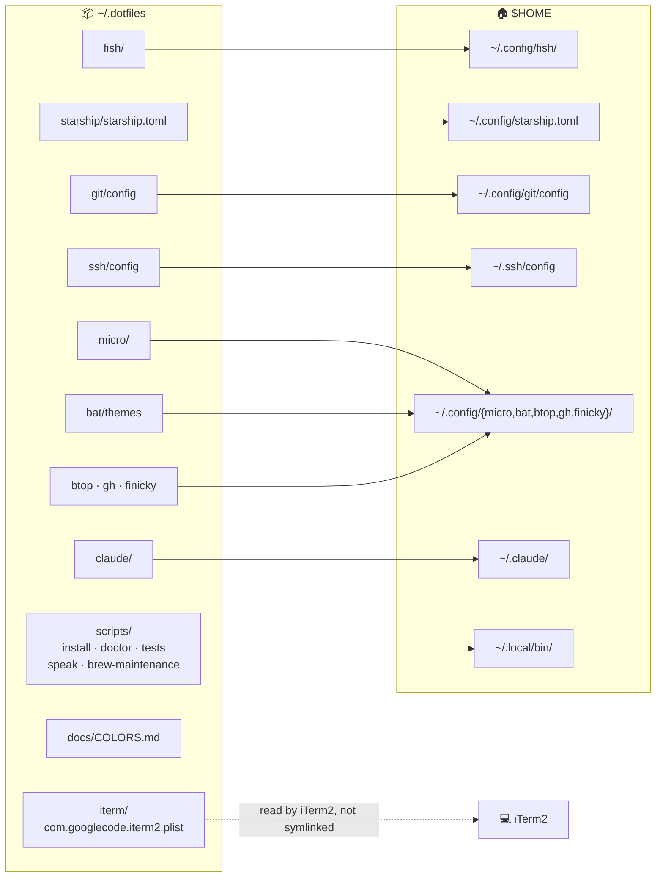
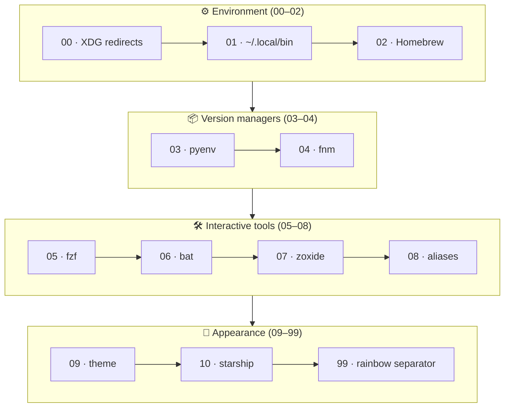
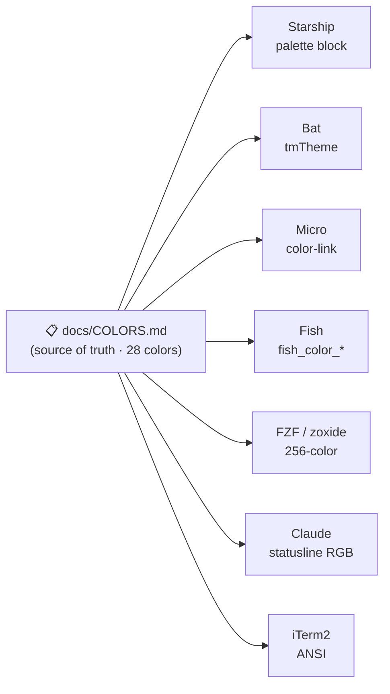
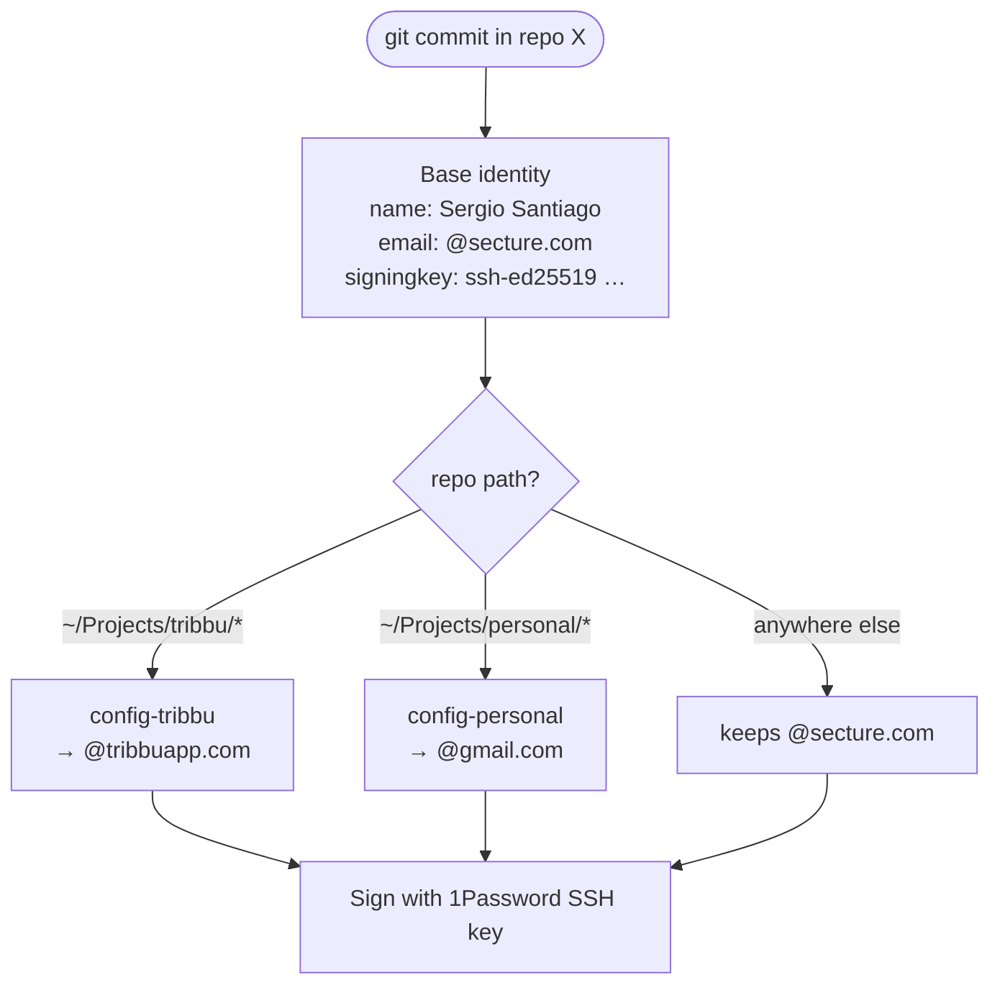
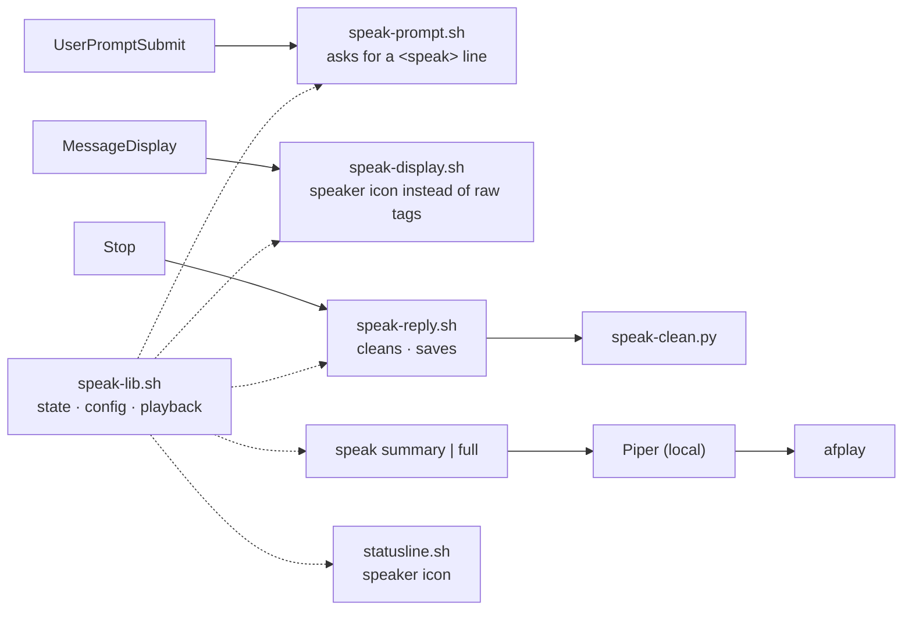

# 🛠️ Sergio’s .dotfiles: macOS Fish Shell Environment

This repository contains my personal macOS development environment configuration, with a focus on:

- 🐟 **Fish shell**
    - Clean setup with modular functions, aliases, color configuration, and a Starship prompt theme aligned to the
      terminal palette.
    - Modular configuration with 12 numbered conf.d files (00-99) for controlled load order.
    - Custom functions: `fish_greeting`, `fish_user_key_bindings`.
    - Compact welcome banner with rainbow effect (`lolcat`) and fixed seed for consistent colors.
- 🧾 **Aliases**
    - Well-structured and documented with practical usage examples, autoloaded from `conf.d/08-aliases.fish`.
    - Includes smart aliases for modern tools: `l`/`ll` (eza), `v` (bat), `tree` (eza --tree), `c`/`c-yolo` (claude), plus `z`/`zi` from `07-zoxide.fish`...
- 🎯 **FZF (Fuzzy Finder)**
    - Comprehensive configuration with `fd` integration for fast file/directory search.
    - Responsive preview windows with `bat` (files) and `eza` (directories).
    - Colors synchronized with the `linked_data_dark_rainbow` palette.
    - Custom keybindings and 80% height layout with rounded borders.
- 🔐 **SSH**
    - Public/private split config, managed from `.dotfiles/ssh` and using 1Password SSH agent for secure key management.
- 🧠 **Git**
    - SSH-based commit signing (1Password agent) with `micro` as commit editor.
    - **Directory-based identities** via `includeIf`: a base identity (`@secture.com`) with automatic
      email overrides for Tribbu (`~/Projects/tribbu/`) and personal (`~/Projects/personal/`) repos,
      all sharing a single signing key. See [Git identities](#-git-identities-multi-account).
- ✏️ **Micro editor**
    - Lightweight terminal-based editor with custom settings and a matching `linked-data-dark-rainbow` color scheme for
      a consistent look with Fish and Starship.
    - Custom theme with true color, icon-based statusline, consistent syntax highlighting, 4-space indentation... and
      more.
- 🌈 **Color theme**
    - Custom `linked_data_dark_rainbow` theme for consistent syntax highlighting, pager, and selection colors.
      Implemented across:
        - Starship (`palettes.linked_data_dark_rainbow` palette, three-line prompt with powerline segments)
        - Fish (`09-theme.fish`)
        - Bat (`linked-data-dark-rainbow.tmTheme`)
        - Micro editor (`linked-data-dark-rainbow.micro`)
        - FZF (`05-fzf.fish` with synchronized color palette)
        - iTerm2 (ANSI colors + UI elements)
    - Includes a custom rainbow separator (`99-rainbow_separator.fish`) to visually divide command output from the next
      prompt.
    - All colors are optimized for pure black backgrounds as well as setups with subtle transparency and blurred effects, ensuring high contrast.
    - **📋 Full color palette documentation:** See [COLORS.md](docs/COLORS.md) for the complete 28-color palette with hex/RGB values and semantic usage across all tools.
- 🔗 **Finicky**
    - Smart browser routing (config in TypeScript). Sets Chrome as the default browser and opens Google Meet
      links automatically in the **Tribbu** Chrome profile.
- 💾 **iTerm2 backup**
    - Full export of preferences (profiles, colors, fonts), easily restorable.
- 🤖 **Claude Code**
    - Custom statusline configuration with comprehensive git, system, and environment info.
    - Usage quota bar with 5-hour utilization percentage, gradient bar, and reset countdown.
    - Granular permission rules: read-only git/gh commands auto-allowed, mutations require confirmation.
    - Tuned for Opus 5: auto mode, `high` effort, Spanish responses, voice dictation, fullscreen TUI, and no AI attribution in commits/PRs.
    - The automatic session recap is off (`awaySummaryEnabled`), because it is generated outside the
      hook pipeline and reaches the screen unprocessed. `/recap` still produces one on demand.
    - Global instructions (`CLAUDE.md`), behaviour rules (`rules/`), hooks, skills and settings all tracked in
      `.dotfiles/claude/`, with a custom `statusline.sh`.
    - 🔊 **Spoken replies**: `/speak summary` reads the last answer out loud through local neural TTS.
      Offline, free, one switch per terminal. See [Spoken Claude Code replies](#-spoken-claude-code-replies).
- 📊 **btop**
    - Modern system resource monitor with custom configuration.
    - Truecolor support, braille graphs, rounded corners, and transparent background.
    - Fast 100ms refresh rate for real-time monitoring.
- 🐙 **GitHub CLI (gh)**
    - GitHub command-line tool configured with SSH protocol.

> These files are meant for personal use and backup. Feel free to explore or adapt.

---

## 📑 Table of Contents

- [🗺️ Architecture](#️-architecture)
    - [📦 Repository layout & symlink map](#repository-layout--symlink-map)
    - [🧪 Tests](#tests)
    - [⚙️ Fish load order](#fish-load-order-confd)
    - [🎨 Color theme propagation](#color-theme-propagation)
    - [🧠 Git identity resolution](#git-identity-resolution)
- [🔧 Setup & Usage Guide](#-setup--usage-guide-restore-on-a-new-machine)
    - [⚡ Quick start](#-quick-start)
    - [🧬 Clone repository](#-clone-repository)
    - [📦 Install dependencies with Brewfile](#-install-dependencies-with-brewfile)
    - [🍺 Homebrew maintenance](#-homebrew-maintenance)
    - [🔗 Symlink configs](#-symlink-configs)
    - [🐟 Set fish as the default shell](#-set-fish-as-the-default-shell)
    - [🧠 Git identities (multi-account)](#-git-identities-multi-account)
    - [🪄 Manual steps (not automatable)](#-manual-steps-not-automatable)
    - [🐟 Fish Shell Configuration Structure](#-fish-shell-configuration-structure)
    - [🧩 Disable Starship in JetBrains IDEs](#-disable-starship-in-jetbrains-ides-terminal)
    - [🔐 SSH Configuration (Public/Private Split)](#-ssh-configuration-publicprivate-split)
    - [💻 iTerm2 Configuration (Theme, Colors & Profiles)](#-iterm2-configuration-theme-colors--profiles)
    - [🔊 Spoken Claude Code replies](#-spoken-claude-code-replies)
- [📋 Color palette reference](docs/COLORS.md)

---

## 🗺️ Architecture

### Repository layout & symlink map

Configs live in this repo and are symlinked into their expected locations (`make link`).
`git/config-personal` and `git/config-tribbu` are **not** symlinked. They are pulled in by
`git/config` via absolute `includeIf` paths.



`scripts/` and `docs/` hold tooling and reference rather than configuration, so nothing in them is
linked except the two commands under `bin/`, `speak` and `brew-maintenance`, which need to be on your
`PATH`: `install.sh` and `doctor.sh` run behind `make link` and `make doctor`, `speak-setup.sh` behind
`make speak-setup`, `tests/` behind `make test`, and `docs/COLORS.md` is the source of truth for the
palette. `links.sh` holds the symlink map itself, sourced by both `install.sh` and `doctor.sh` so that
what gets created and what gets verified cannot drift apart.

`iterm/` is the one directory of real configuration that is not symlinked either: iTerm2 owns its
plist and rewrites it on quit, so it is pointed at this folder through **Load preferences from a
custom folder** instead. See [iTerm2 Configuration](#-iterm2-configuration-theme-colors--profiles).

### Tests

`make test` runs every `scripts/tests/test-*.sh` through a plain bash runner, no framework and no
extra formula to install. Tests never touch the real Homebrew: `brew-maintenance` takes its brew
executable, its stamp path and its gcloud state file from environment variables, so each case runs
against a fake `brew` that logs what it was asked to do. That log is what lets a test prove a
negative, such as no `upgrade` ever being invoked with `--greedy`.

`make doctor` is the complement. It checks the machine, while `make test` checks the scripts.

### Fish load order (`conf.d/`)

Fragments are sourced in lexical order. Environment first, then version managers and tools,
then appearance, and finally a cosmetic separator hook.



### Color theme propagation

`docs/COLORS.md` is the single source of truth for the `linked_data_dark_rainbow` palette,
replicated by hand into each tool's native format. `make colors-check` lints for drift.



### Git identity resolution

A commit's author email is chosen by where the repository lives. The name and signing key
are always inherited from the base identity.



---

## 🔧 Setup & Usage Guide (Restore on a new machine)

### ⚡ Quick start

```bash
git clone git@github.com:sergio-santiago/.dotfiles.git ~/.dotfiles
cd ~/.dotfiles
make install          # installs Brewfile packages + symlinks every config
make default-shell    # set fish as the default login shell
make doctor           # verify tools, symlinks and environment
```

Then finish the [manual steps](#-manual-steps-not-automatable), the handful of things no script can
do for you, starting with the apps Homebrew does not manage.
The sections below explain each piece in detail.

#### Make targets

| Target | What it does |
|--------|--------------|
| `make install` | `brew` + `link`, full setup on a new machine |
| `make brew` | Install all packages/apps from the `Brewfile` |
| `make link` | Symlink configs into `~/.config`, `~/.claude`, `~/.ssh`, `~/.local/bin` (idempotent, backs up existing files) |
| `make default-shell` | Add Homebrew fish to `/etc/shells` and `chsh` to it |
| `make doctor` | Verify required tools, symlinks and environment are healthy |
| `make colors-check` | Lint the `linked_data_dark_rainbow` palette for drift |
| `make speak-setup` | Install Piper + Spanish voices so Claude Code can speak its replies |
| `make brew-maintenance` | Update, tidy up and review Homebrew (also `bm` in fish) |
| `make test` | Run the test suite |

> The installer is **idempotent** and **non-destructive**: re-running it is safe, and any existing
> file it would overwrite is first moved to `~/.dotfiles-backup/<timestamp>/`.

---

### 🧬 Clone repository

```bash
git clone git@github.com:sergio-santiago/.dotfiles.git ~/.dotfiles
```

---

### 📦 Install dependencies with Brewfile

Development environment is reproducible with [Homebrew](https://brew.sh) and a `Brewfile`.  
Run the following command to install CLI tools and apps:

```bash
brew bundle --file ~/.dotfiles/Brewfile
```

This will install:

#### 🔖 Taps
- **hamed-elfayome/claude-usage**: Claude API usage tracking
- **hashicorp/tap**: HashiCorp tools (provides `terraform`)

#### 🛠️ CLI tools
- **bat**: `cat` clone with syntax highlighting
- **btop**: modern system resource monitor
- **eza**: improved `ls` with colors and icons
- **fd**: fast and user-friendly alternative to `find`
- **fish**: friendly interactive shell
- **fnm**: fast Node.js version manager
- **fzf**: fuzzy finder for the terminal
- **gh**: GitHub CLI tool
- **jq**: JSON processor for command line
- **lolcat**: rainbow coloring for terminal output
- **micro**: lightweight terminal text editor
- **mole**: deep clean and optimize macOS
- **node**: JavaScript runtime
- **poppler**: PDF rendering library
- **pyenv**: manage multiple Python versions
- **starship**: fast and customizable prompt
- **terraform**: infrastructure as code tool
- **zoxide**: smarter `cd` command with jump history

#### 💻 Apps (casks)
- **Claude Usage Tracker**: Claude API usage dashboard
- **Finicky**: control which browser/profile opens links
- **Fira Code Nerd Font**: a developer-friendly font with ligatures and Nerd Font icons
- **Google Cloud CLI**: `gcloud` command-line interface
- **iTerm2**: terminal emulator for macOS
- **Thaw**: menu bar manager for macOS

> 🔄️ Keeping Homebrew current is a deliberate step you take by hand: run `brew-maintenance`
> (or `bm`). See [Homebrew maintenance](#-homebrew-maintenance) for what it does and for the
> reminder that suggests it.
>
> Homebrew will not load a formula from a tap it does not trust. `terraform` and
> `claude-usage-tracker` come from third-party taps, so their `Brewfile` entries carry
> `trusted: true` and are written with the tap-qualified name that the flag needs to apply.

---

### 🍺 Homebrew maintenance

```bash
bm                      # the usual run
bm --check              # report what is pending, change nothing
bm --with-external      # also run gcloud components update
make brew-maintenance   # same thing, from the repo
```

`scripts/bin/brew-maintenance` runs the maintenance steps and prints one summary. `bm` is the
fish alias, and `make link` puts the command on your `PATH`, so it also works from bash, zsh
and anything else that can find a binary.

**Actions decide the exit status, reports never do.** That split is the point of the script:

| Step | Class | Effect |
|------|-------|--------|
| `brew update` | action | refreshes the package index |
| `brew upgrade` | action | installs what is outdated |
| `brew cleanup` | action | reclaims disk space |
| `brew autoremove` | action | drops orphaned dependencies |
| `brew doctor` | report | counted and shown, never fatal |
| self-updating casks | report | listed with brew's record beside the version available |
| `gcloud` pending work | report | read from the SDK's own state file |

Two things follow from it. `brew doctor` exits 1 for any warning it has, and its own output asks
you to ignore those warnings, so a run that inherited that status called a healthy machine broken.
And because the steps are independent rather than chained with `&&`, a failed `brew update` no
longer cancels cleanup, autoremove and the review: upgrade still has a cached index to work with.
Exit 0 means every action succeeded, whatever doctor had to say.

#### Casks that update themselves

`thaw` and `gcloud-cli` carry their own updaters, so Homebrew's receipt records the version *it*
installed rather than the one now on disk. Reported, and left alone on purpose:

```
Casks with their own updater, left alone:
  thaw           brew records 1.1.0      latest known 1.2.0
```

The app is already current: its bundle reports 1.2.0, so what is behind is the bookkeeping, not the
software. `brew upgrade --cask --greedy` would download a whole app to install a version already
installed. The command to correct the record is printed if you ever want it, and never run for you.

These lines stay green rather than yellow. They are not work to do, and a colour that appears on
every single run stops being read.

The drift does not repair itself. A cask with `auto_updates: true` is skipped by `brew upgrade`, so
brew never rewrites its receipt unless you force it, which is what `--greedy-auto-updates` is for.
That matters in one case only: if the receipt names a dependency you no longer have, `brew doctor`
reports a missing dependency that nothing actually misses. Forcing the upgrade once regenerates the
receipt and clears it.

Third-party updaters work the same way. `gcloud components update` is reported by default, read
free and offline from `~/.config/gcloud/.last_update_check.json`, where the SDK writes its own
pending notices. It only runs behind `--with-external`, because doing it non-interactively means
accepting every prompt sight unseen.

#### The reminder

A finished run is recorded in `~/.cache/brew-maintenance/last-run`, the only place that knows
when maintenance last happened. Two surfaces read it:

- **the fish greeting**, through `brew_nudge`, which prints one dim line once the last run is
  7 days old or older. Two file reads and no subprocess: 0.2 ms against a 140 ms shell startup.
  Tune it with `set -U brew_nudge_days 14`, or silence it with `0`.
- **`make doctor`**, which can afford the expensive question the greeting cannot. It reports the
  age of the last run, the age of the package index, and how many packages are outdated, read
  offline in about half a second.

It is a suggestion and nothing else. No daemon, no scheduled job, no background refresh, and
nothing that updates a package without you asking. `bm --check` answers "what is pending" at any
time, and `--check` writes no stamp, because looking is not maintaining.

---

### 🔗 Symlink configs

The recommended way is the installer, which creates every symlink, backs up anything it would
overwrite, creates `~/.ssh/config.private`, and rebuilds the bat cache:

```bash
make link
```

It wires the repo into `$HOME` like this:

| Source (`~/.dotfiles/…`) | Destination |
|--------------------------|-------------|
| `ssh/config` | `~/.ssh/config` |
| `fish/{conf.d,functions,config.fish}` | `~/.config/fish/…` |
| `starship/starship.toml` | `~/.config/starship.toml` |
| `git/config` | `~/.config/git/config` |
| `micro/{settings.json,colorschemes/…}` | `~/.config/micro/…` |
| `bat/themes` | `~/.config/bat/themes` |
| `finicky/finicky.ts` | `~/.config/finicky/finicky.ts` |
| `btop/btop.conf` | `~/.config/btop/btop.conf` |
| `gh/config.yml` | `~/.config/gh/config.yml` |
| `claude/{CLAUDE.md,settings.json,statusline.sh}` | `~/.claude/…` |
| `claude/{rules,hooks,skills/speak}` | `~/.claude/…` |
| `claude/{speak-lib.sh,speak-clean.py}` | `~/.claude/…` |
| `scripts/bin/speak` | `~/.local/bin/speak` |
| `scripts/bin/brew-maintenance` | `~/.local/bin/brew-maintenance` |

<details>
<summary>Prefer to link manually? (click to expand)</summary>

```bash
# SSH
mkdir -p ~/.ssh
ln -sfh ~/.dotfiles/ssh/config ~/.ssh/config

# Fish
mkdir -p ~/.config/fish
ln -sfh ~/.dotfiles/fish/conf.d ~/.config/fish/conf.d
ln -sfh ~/.dotfiles/fish/functions ~/.config/fish/functions
ln -sfh ~/.dotfiles/fish/config.fish ~/.config/fish/config.fish

# Starship
ln -sfh ~/.dotfiles/starship/starship.toml ~/.config/starship.toml

# Git
mkdir -p ~/.config/git
ln -sfh ~/.dotfiles/git/config ~/.config/git/config

# Micro
mkdir -p ~/.config/micro/colorschemes
ln -sfh ~/.dotfiles/micro/settings.json ~/.config/micro/settings.json
ln -sfh ~/.dotfiles/micro/colorschemes/linked-data-dark-rainbow.micro ~/.config/micro/colorschemes/linked-data-dark-rainbow.micro

# Bat
mkdir -p ~/.config/bat
ln -sfh ~/.dotfiles/bat/themes ~/.config/bat/themes
bat cache --build

# Finicky
mkdir -p ~/.config/finicky
ln -sfh ~/.dotfiles/finicky/finicky.ts ~/.config/finicky/finicky.ts

# Claude Code
mkdir -p ~/.claude ~/.local/bin
ln -sfh ~/.dotfiles/claude/CLAUDE.md ~/.claude/CLAUDE.md
ln -sfh ~/.dotfiles/claude/settings.json ~/.claude/settings.json
ln -sfh ~/.dotfiles/claude/statusline.sh ~/.claude/statusline.sh
ln -sfh ~/.dotfiles/claude/rules ~/.claude/rules
ln -sfh ~/.dotfiles/claude/hooks ~/.claude/hooks
mkdir -p ~/.claude/skills
ln -sfh ~/.dotfiles/claude/skills/speak ~/.claude/skills/speak
ln -sfh ~/.dotfiles/claude/speak-lib.sh ~/.claude/speak-lib.sh
ln -sfh ~/.dotfiles/claude/speak-clean.py ~/.claude/speak-clean.py
ln -sfh ~/.dotfiles/scripts/bin/speak ~/.local/bin/speak
ln -sfh ~/.dotfiles/scripts/bin/brew-maintenance ~/.local/bin/brew-maintenance

# btop
mkdir -p ~/.config/btop
ln -sfh ~/.dotfiles/btop/btop.conf ~/.config/btop/btop.conf

# GitHub CLI (gh)
mkdir -p ~/.config/gh
ln -sfh ~/.dotfiles/gh/config.yml ~/.config/gh/config.yml
```

> ⚠️ **Note:** Manual symlinks overwrite existing files with no backup. `make link` is safer.

</details>

---

### 🐟 Set fish as the default shell

```bash
make default-shell        # adds fish to /etc/shells and runs chsh
```

Or manually:

```bash
echo /opt/homebrew/bin/fish | sudo tee -a /etc/shells
chsh -s /opt/homebrew/bin/fish
```

---

### 🧠 Git identities (multi-account)

`git/config` defines a base identity and overrides only the **email** per directory, while
`user.name` and the SSH `signingkey` are inherited everywhere (one verified key for all accounts):

| Repo location | Identity file | Email |
|---------------|---------------|-------|
| anywhere (default) | `git/config` | `sergio@secture.com` |
| `~/Projects/tribbu/…` | `git/config-tribbu` | `sergiosantiago@tribbuapp.com` |
| `~/Projects/personal/…` | `git/config-personal` | `@gmail.com` |

The overrides are pulled in via `includeIf "gitdir:…"` using absolute paths, so they work without
being symlinked. To use them, just clone repos under the matching directory:

```bash
git -C ~/Projects/tribbu/some-repo config user.email   # → sergiosantiago@tribbuapp.com
```

GitHub HTTPS credentials are delegated to `gh auth git-credential`, so run `gh auth login` once.

---

### 🪄 Manual steps (not automatable)

A few things can't be symlinked and must be done by hand on a new machine:

1. **Install 1Password and enable its SSH agent** (required for SSH auth **and** commit signing):
   1Password → **Settings → Developer → Use the SSH agent**. Commit signing uses `op-ssh-sign`,
   already configured in `git/config`, so every `git commit` fails with
   `cannot exec op-ssh-sign` until the app is there. It is not in the `Brewfile` because it is
   installed from 1password.com, outside Homebrew.
2. **Install Google Chrome.** `finicky/finicky.ts` names it as the default browser and routes Meet
   links to the **Tribbu** profile, so link routing does nothing useful without it. Also outside
   Homebrew, and the profile itself has to be signed in by hand.
3. **Load iTerm2 preferences**. See [iTerm2 Configuration](#-iterm2-configuration-theme-colors--profiles) below.
4. **Create your private SSH hosts** in `~/.ssh/config.private` (the installer creates an empty
   `0600` file for you). See [SSH Configuration](#-ssh-configuration-publicprivate-split) below.
5. **Install the Claude Code Slack plugin.** `claude/settings.json` enables
   `slack@claude-plugins-official`, but the plugin itself is cached under `~/.claude/plugins/` and is
   not part of this repo. Run `/plugin` in Claude Code to install it, then authenticate.
6. **Add the Context7 MCP server.** `claude/rules/context7.md` instructs Claude to fetch library docs
   through Context7, and that rule *is* symlinked, so without the server a new machine gets an
   instruction pointing at a tool that isn't there. MCP servers live in `~/.claude.json`, outside the
   repo: add it with `claude mcp add`.

---

### 🐟 Fish Shell Configuration Structure

The Fish shell configuration is fully modular and follows a numbered loading order:

#### conf.d/ files (autoloaded in order):
- `00-xdg_redirects.fish`: XDG base directories
- `01-local-bin.fish`: Local user binaries PATH
- `02-homebrew.fish`: Homebrew environment
- `03-pyenv.fish`: Python version management
- `04-fnm.fish`: Node.js version management
- `05-fzf.fish`: Fuzzy finder with fd, bat, eza integration
- `06-bat.fish`: Bat (cat replacement) configuration
- `07-zoxide.fish`: Smart directory jumper
- `08-aliases.fish`: Command aliases and helper functions
- `09-theme.fish`: linked_data_dark_rainbow color theme
- `10-starship.fish`: Starship prompt initialization
- `99-rainbow_separator.fish`: Rainbow command separator

#### functions/ directory:
- `fish_greeting.fish`: Compact welcome banner with lolcat rainbow
- `fish_user_key_bindings.fish`: Custom key bindings
- `brew_nudge.fish`: Suggests `bm` when the last maintenance run is old enough

---

### 🧩 Disable Starship in JetBrains IDEs Terminal

If custom Starship config renders incorrectly in the integrated terminal of JetBrains IDEs,
you can disable it by overriding the config path:

1. Go to **Preferences > Tools > Terminal**
2. Set the shell path to:

   ```bash
   env STARSHIP_CONFIG=/dev/null /opt/homebrew/bin/fish
    ```

This launches fish with an empty Starship config, disabling the prompt in JetBrains IDE
without affecting your normal terminal.

---

### 🔐 SSH Configuration (Public/Private Split)

To keep personal hosts out of version control:

1. The tracked `ssh/config` contains:

   ```ssh
   Include ~/.dotfiles/ssh/config.public
   Include ~/.ssh/config.private
   ```

2. `~/.ssh/config.private` holds your private/machine-specific hosts. `make link` creates it
   automatically as an empty `0600` file. To create it by hand instead:

   ```bash
   touch ~/.ssh/config.private
   chmod 600 ~/.ssh/config.private
   ```

3. Put your private or machine-specific SSH hosts there (e.g., staging, personal VPS, etc.)

---

### 💻 iTerm2 Configuration (Theme, Colors & Profiles)

To preserve the full appearance and behavior of iTerm2 environment (profiles, color schemes, font, etc.), the app
preferences are exported and tracked here:

```bash
~/.dotfiles/iterm/com.googlecode.iterm2.plist
```

✅ **To load this config on a new Mac:**

1. Open **iTerm2 > Settings > General > Preferences**
2. Enable: ✔️ `Load preferences from a custom folder or URL`
3. Set the folder path to:

   ```bash
   ~/.dotfiles/iterm
   ```

4. For saving changes, set **"Save changes"** to: `When Quitting` (or optionally `Manually`)
5. Restart iTerm2 to apply all changes

---
### 🔊 Spoken Claude Code replies

Dictating prompts is only half of a hands-free loop. This reads the answers back, out loud, through
**[Piper](https://github.com/OHF-Voice/piper1-gpl)**: a neural TTS engine that runs on the machine.
Offline, free, unlimited, no API key.

```bash
make speak-setup     # one-off: ~130 MB of voices + ~170 MB of venv, outside the repo
/speak on            # arm this console
```

**Nothing is ever read automatically.** When a console is on, each reply is cleaned and kept ready,
and the two commands appear under its spoken block. You skim the answer and decide whether it is
worth hearing. No audio you did not ask for, and no deciding in advance what "reading" should mean.

#### One switch per console

With several sessions open, a global switch is unusable: one console reading aloud while you dictate
into another means the mic picks up the synthetic voice and your prompt comes out garbled. So each
terminal tab decides for itself, and the status line shows which:

A speaker icon appears in the status line while a console is on: replies prepared, commands offered. Off shows
nothing at all: the indicator is there to flag the exception, and off is the rule.

Off by default in every new console. The switch is keyed on the iTerm2 pane UUID, so restarting
`claude` in the same tab keeps that tab's setting.

#### Commands

`/speak` from the Claude Code prompt, or `speak` from a terminal. Same thing. It is a plain
executable rather than a fish function precisely so `! speak …` works from inside Claude Code, where
`!` runs under bash. Both forms read aloud immediately, and `! speak summary` also puts the command's own
confirmation on screen instead of a line written by Claude.

| Command | What it does |
|---------|--------------|
| `/speak` | Toggle this console |
| `/speak on` / `/speak off` | Set explicitly (`off` also discards what was saved) |
| `/speak summary` | Read the last reply's summary out loud |
| `/speak full` | Read the whole last reply out loud |
| `/speak stop` | Shut up right now, mid-sentence |
| `/speak test` | Check that audio works at all |

The skill runs `` !`speak $ARGUMENTS` `` *before* the prompt reaches Claude, so the action happens
immediately and only a one-line confirmation comes back. `disable-model-invocation: true` keeps it
user-only. Claude cannot decide to start talking on its own.

> **Not named `voice`**: Claude Code's built-in `/voice` is dictation: it *listens*. This is the
> opposite direction, and reusing the word for both would be a coin flip every time.

Voice, speed and how much of a reply is read are global taste, hand-edited in `~/.claude/speak.conf`:

```ini
voice=es_ES-davefx-medium     # or es_ES-sharvard-medium, see ~/.local/share/piper/voices
speed=1.0                     # <1 faster, >1 slower
max_chars=11600               # optional, caps both the summary and the full text
```

The file does not exist until you create it. The defaults above are the built-in ones. `speed` and
`max_chars` are validated before use, so a typo falls back to the default instead of quietly breaking
the hook.

#### Summary or the whole reply

Both are prepared for every reply, and both strip code, tables, links, paths and markup, whatever a
voice cannot convey. The difference is length:

- **`summary`** is a closing line Claude writes *to be heard*, about twenty seconds. It exists because
  a reply adapted from prose never sounds as good as one written for the ear.
- **`full`** is the entire reply, cleaned. Capped at ten minutes of audio (11 600 chars, the default
  voice reads 19.4 chars/s, measured) so a runaway reply cannot hold the speaker hostage.

In `full`, inline paths become the name a person would say (`claude/speak-lib.sh` → "speak lib")
rather than being deleted, which would leave sentences dangling mid-clause.

#### Nothing accumulates

Each console keeps at most one saved reply, overwritten every turn, and `speak off` deletes it.
Files left behind by consoles you closed are pruned after a week.

#### Cutting a reply off mid-sentence

Claude Code keybindings only map to its own internal actions, so a dedicated hotkey is not possible.
Three things work: **sending the next message** (the prompt hook kills playback first, so answering
back silences it), **`/speak stop`**, and **`/speak off`** for good. All three are scoped to the
console you are in: typing here never cuts off what another pane is saying.

#### How it works

Three hooks in `claude/settings.json`, all no-ops in consoles that are off. Every piece resolves state
through one shared helper (`claude/speak-lib.sh`), so the indicator can never disagree with reality:



- **`speak-prompt.sh`** asks Claude for the `<speak>` line, and stops playback. Sending a message
  means you are done listening. Because the instruction lives in a hook and not in `CLAUDE.md`, it
  vanishes the moment you run `speak off`. It bails out early on a prompt that *is* a `speak` command,
  **before** silencing anything, because a turn asking for a reading must not cancel the one its own command
  just started. That order matters, and the two lines are commented in the hook for a reason.
- **`speak-display.sh`** rewrites the raw tags on screen into a grey speaker icon with grey italic text, and
  puts the two commands at the end of a `╰──▸` that descends from the icon's own column. `MessageDisplay` is
  display-only, so the transcript keeps the real tags, which is what the Stop hook reads. Text
  arrives in `delta` chunks, so each tag is rewritten independently rather than as a pair: a block
  split mid-stream still renders. The opening tag only matches at the start of a line, so prose
  mentioning it mid-sentence is left alone, while a closing tag is rewritten wherever it appears, which is
  the price of that independence, because a chunk cannot know whether an opening tag arrived in an earlier
  one. One newline either side of a tag is swallowed with the surrounding blanks, so tags written on
  lines of their own still render as a single unit.

  Only assistant text streams through this hook. Claude Code's end-of-turn recap is generated
  separately and reaches the screen without passing any hook, so `speak-prompt.sh` tells Claude the
  block belongs at the end of a reply and nowhere else.
- **`speak-reply.sh`** cleans the reply via **`speak-clean.py`** and saves both versions. It prints
  nothing, plays nothing and never touches Piper.
- **`speak`** does the reading itself, the moment you ask. Synthesis is detached, so nothing waits on
  audio: the command returns immediately and Piper keeps going.

Playback is identified by the temp file it was handed, console id included, so `speak stop` in one
pane cannot silence another. Starting a *new* reading does stop every other one, because there is only one
pair of speakers.

The cleaning lives in its own Python file rather than a heredoc inside the hook: embedded Python
cannot be compiled, linted or run on its own, and turning prose into speech is fiddly enough to be
worth exercising directly against real payloads.

Synthesis takes about a second per sentence. `make doctor` reports whether Piper, the models, the
Python the cleaner needs and the per-console switches are all in place.
